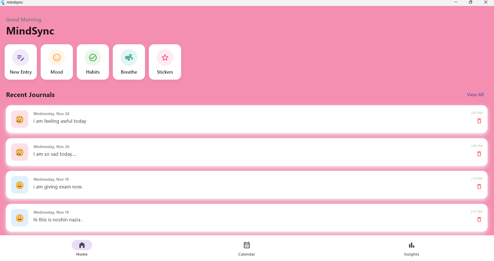
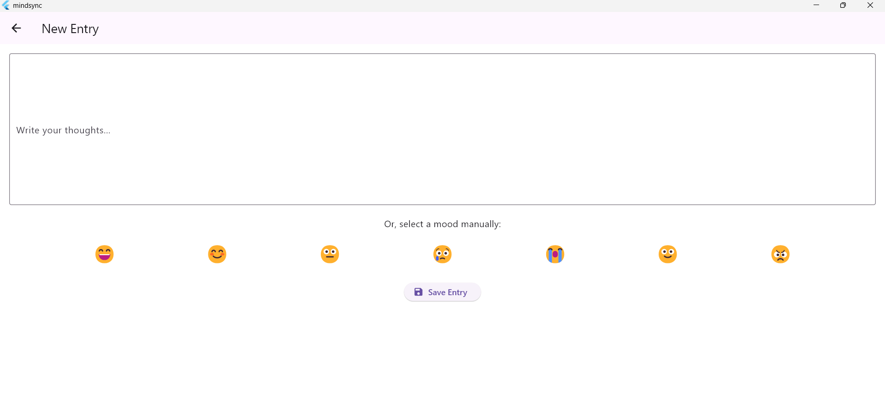
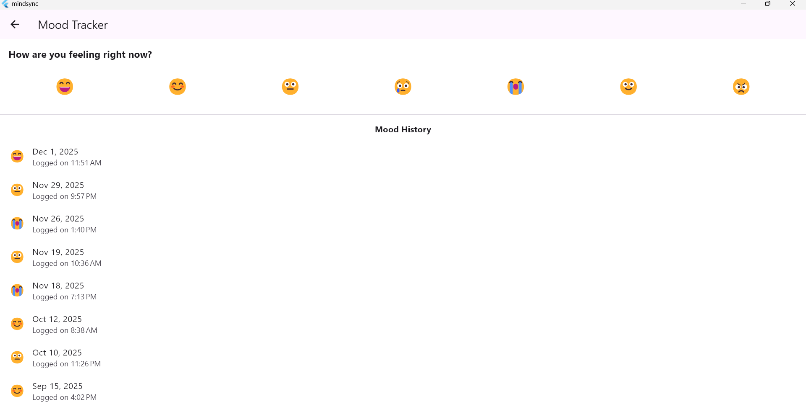
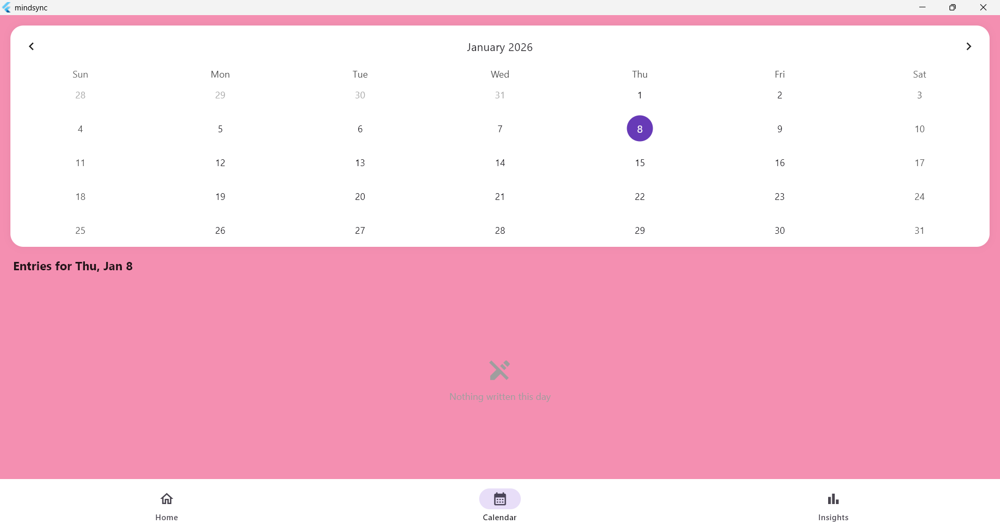

# 📱 MindSync – Flutter Lifestyle App

MindSync is a cross-platform Flutter application designed to help users maintain mental well-being through a digital diary with automated mood detector, mood tracking, and habit tracking system.

---

## 🚀 Features
- 📝 Digital diary with history view
- 😊 Mood tracking (daily entries)
- 🔁 Habit tracking
- 📅 Calendar-based diary view
- 💾 Local data storage
- 📱 Cross-platform (Android & iOS)

---

## 🛠️ Technologies Used
- Flutter
- Dart
- SQLite / Local Storage
- Material UI

---

## 📸 Screenshots

### 🏠 Home Screen

### 📝 Diary Entry

### 😊 Mood Tracker

### 📅 Calendar View

---

## ⚙️ How to Run the Project

1. Clone the repository

git clone https://github.com/USERNAME/mind-sync-flutter-app.git

2. Navigate to the project directory
cd mind-sync-flutter-app

3. Install dependencies
flutter pub get

4. Run the app
flutter run

📂 Project Structure

lib/
├── main.dart
├── screens/
├── widgets/
├── models/
└── services/

👩‍💻 Author
Noshin Nazia
CSE, Patuakhali Science & Technology University